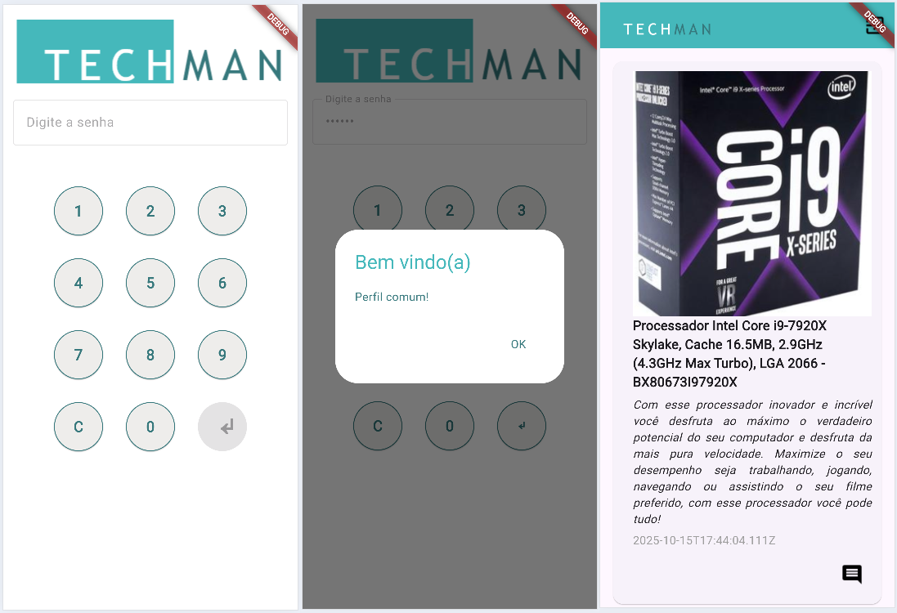
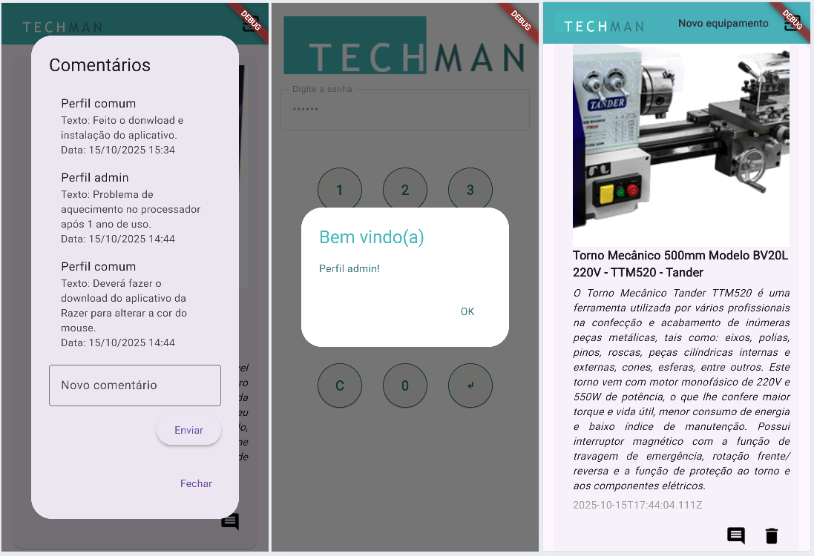
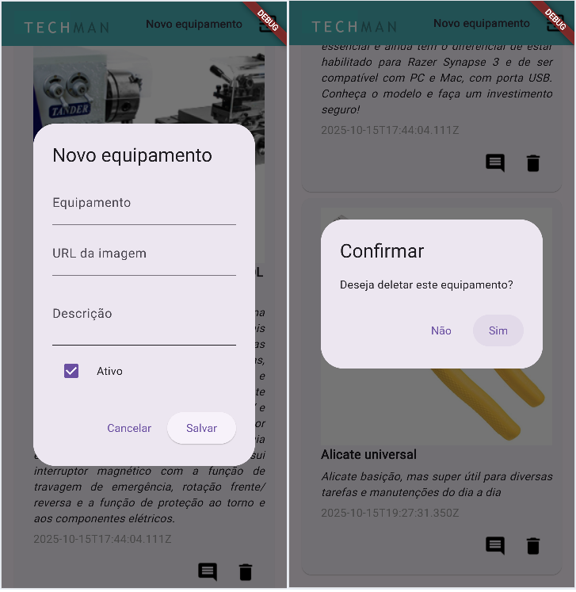

# techmanflutter2025

Aplicativo de manutenção de equipamentos industriais desenvolvido em Flutter. Para aulas de Flutter.

## Instalação
1. Clone o repositório:
```bash
git clone
```
2. Navegue até o diretório do projeto:
```bash
cd techmanflutter2025
```
3. Instale as dependências:
```bash
flutter pub get
```
4. Execute o aplicativo:
```bash
flutter run
```
## Funcionalidades
- Login de usuário por perfil (Admin e Comuns)
- Quando perfil comum
    - Listar equipamentos
    - Ver e adicionar comentários
    - Sair do perfil
- Quando perfil admin
    - Todas as funcionalidades do perfil comum
    - Cadastrar novo e equipamento
    - Excluir equipamento

## Screenshots

|Telas de login e perfil comum|
|:-:|
||
|Obs: O botão de entrar só fica habilitado após uma senha de 6 dígitos, autentica o usuário através da API e direciona para a Home armazenando o perfil obtido localmente.|
||
|Obs: Como perfil comum é possível ver a lista de equipamentos e ver e adicionar comentários, com o perfil de Administrador é possível também excluir e adicionar novos equipamentos, além das funcionalidades do perfil comum|
||